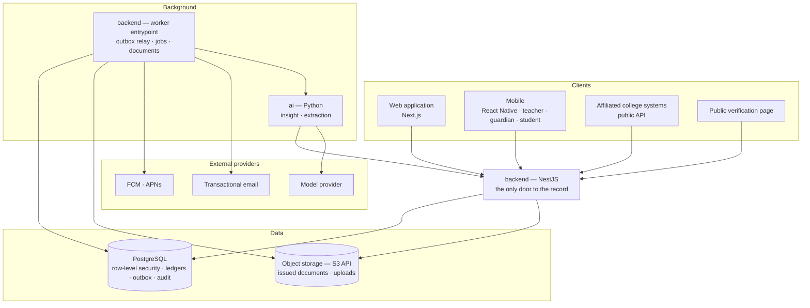

# ARCH-001 — System context

## The rule this picture encodes

**There is one door.** No client, and no service, reaches PostgreSQL or object
storage except through `backend` or its worker entrypoint, which shares the
package. Authentication, tenant context, authorisation, the output allowlist,
rate limiting, audit and observability happen at that door, once.

Three consequences are load-bearing and are enforced elsewhere:

- **The intelligence service has no data access** (`ADR-018 §3`). It receives
  computed Metric values and returns language. The arrow from `INT` to `API` is a
  normal, tenant-scoped API call under the same permission model as any other
  caller — not a privileged channel.
- **The worker is not a second door — it is not a door at all.** It exposes no
  inbound network surface: no HTTP server, no RPC listener, nothing published. It
  dials out; nothing dials in (`ADR-021`). It shares the domain package and the same
  tenant-context mechanism (`ADR-019`), entering through a queue consumer rather than
  a request.
- **A job is authenticated before it executes.** Payloads are sealed by the backend
  and verified on dequeue, because a job carries the institution and principal its
  work runs as — an injected or altered job would be a tenant escalation reached
  without ever defeating row-level security (`ADR-021`).
- **The public verification page reads the record, not a stored copy.** It is the
  one unauthenticated read path, and it exposes only what confirms a document's
  authenticity (`DOM-007-N`).

## What stays in PostgreSQL

Tenant isolation, as row-level security policies. The append-only ledgers. The
effective-dating constraints that make overlapping policy versions impossible.
The outbox. The audit trail. These are guarantees the database enforces, not
conventions the application maintains — see `ADR-002`, `ADR-003`, `ADR-004`.

## Trust boundaries

| Boundary | Crossed by | Control |
| --- | --- | --- |
| Browser / device → API | authenticated request | token verification, tenant context from Membership (`ADR-019`) |
| Affiliated college → API | API key, scoped | affiliation scope, rate limit, audit on both sides (`DOM-005`) |
| Public → API | verification code only | minimum disclosure, no authentication, rate limited |
| API → PostgreSQL | scoped transaction | tenant claim set per transaction; RLS refuses otherwise |
| Worker → external provider | job | no tenant data beyond what the message requires |
| API/worker → intelligence | queue message | Metric values in, language out; no raw records |
| **Anything → worker** | **nothing** | **No inbound surface exists** (`ADR-021`) |
| **Anything → `ai/`** | **nothing public** | **Listener is loopback/private only** (`ADR-021`) |
| Backend → queue | transactional enqueue | Only the backend's database role may create a job; payload sealed and verified on dequeue |

## Related Documents

- `ARCH-002` layering · `ARCH-003` module map · `ARCH-006` events and jobs ·
  `ARCH-007` security · `ADR-002` · `ADR-018` · `ADR-019`
