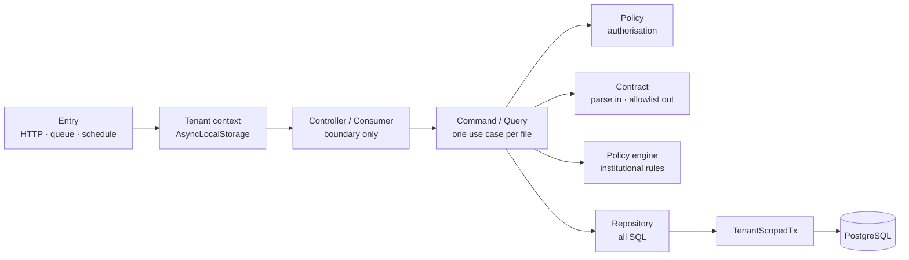

# ARCH-002 — Layering

One direction only. A controller never touches a repository. A repository never
imports a command, a query, a policy or a controller.

## Responsibilities

| Layer | Owns | Never |
| --- | --- | --- |
| Entry | Establishing tenant context, once (`ADR-019`) | Anything else |
| Controller / Consumer | The transport shape. One line per handler | Logic, data access, normalisation, private methods |
| Command | One write use case. The transaction boundary | Query construction, row shaping |
| Query | One read use case | Writes, side effects |
| Policy | The **authorisation** decision for this module | Data access beyond what the decision needs |
| Policy engine | Evaluating **institutional** rules — grading, promotion, eligibility, fees (`DOM-009`) | Authorisation, data access, side effects |
| Contract | Input parsing and the output allowlist | Business rules |
| Repository | All SQL for the module | Any upward dependency |
| Mapper | Pure row shaping | Anything impure |

## Two things called "policy"

Edrithm has both, and conflating them would be a serious error.

- **`<feature>.policy.ts`** answers *may this actor do this?* — authorisation
  (`DOM-011`).
- **The policy engine** answers *what do this institution's rules say?* — grading,
  promotion, attendance thresholds, fee cycles, identifier formats (`DOM-009`).

The first is code. The second evaluates versioned data and is pure, deterministic
and explainable. Naming keeps them apart: authorisation lives in `*.policy.ts`,
institutional rules are always *rule evaluation* and never called a policy check
in code.

## Why there is no service layer

A single `<feature>.service.ts` becomes where orchestration, queries and helpers
accumulate. It grows past every budget and is then split by line count rather than
by meaning.

One file per use case removes the problem structurally instead of policing it. The
controller's constructor becomes a table of contents; `ls commands/` lists what the
module can do.

## Transactions

The command owns the transaction. It obtains a `TenantScopedTx` from the
transaction helper — which sets the tenant claim for that transaction and throws if
context is absent (`ADR-019`) — calls whatever repository methods it needs, writes
its outbox entries in the same transaction (`ADR-010`), and commits.

**Two commands never share a transaction.** If two things must commit together,
they are one command.

**Crossing a tenant boundary opens a new transaction** for the other institution,
authorised by an affiliation and audited (`DOM-005`, `ADR-019 §6`). Context is
never mutated in place.

## Related Documents

- `ARCH-001` · `ARCH-003` · `ADR-006` · `ADR-010` · `ADR-019` · `DOM-009` · `DOM-011`
