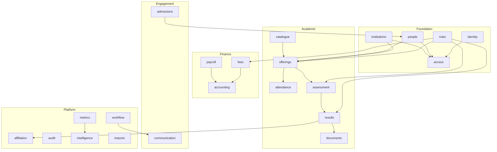

# ARCH-003 — Module map

Each module owns a set of tables and is the only writer to them. The authoritative
ownership list must be established in the backend module ledger before data implementation; this document explains the shape
and why the boundaries fall where they do.

Arrows are **published-interface** dependencies — module A imports
`modules/B/public/B.api.ts` and nothing else. No arrow means no import, and
`dependency-cruiser` enforces it (`ED-001`).

## What each module owns

| Module | Owns | Domain |
| --- | --- | --- |
| `identity` | accounts, credentials, tokens, key rotation | `ADR-009` |
| `people` | Person, Membership, relationships, duplicate detection | `DOM-004` |
| `institutions` | Institution, OrgUnit tree, Academic Session, Term, Calendar | `DOM-002`, `DOM-003` |
| `access` | roles, capabilities, grants, scopes, support grants | `DOM-011` |
| `rules` | Policy documents, versions, resolution, evaluation | `DOM-009` |
| `catalogue` | Course, SchemeOfStudy, learning outcomes | `DOM-006` |
| `offerings` | Cohort, Offering, Enrollment, timetable, ClassMeeting | `DOM-006` |
| `attendance` | attendance records, device ingestion | `DOM-003`, `JRN-006` |
| `assessment` | Assessment, the marks ledger, AwardList, moderation | `DOM-007` |
| `results` | Result computation, declaration, post-declaration workflows | `DOM-007` |
| `documents` | templates, issuance, reissue, verification | `DOM-007`, `ADR-020` |
| `fees` | fee heads, structures, concessions, invoices, challans, payments | `DOM-008` |
| `accounting` | chart of accounts, journals, expenses, periods, uploads | `DOM-008`, `ADR-017` |
| `payroll` | engagements, runs, register | `DOM-008`, `ADR-017` |
| `admissions` | applicants, tests, merit, offers, seat allocation | `JRN-004` |
| `communication` | notification templates, dispatch, delivery log, preferences | `ADR-016` |
| `affiliation` | Affiliation, scope, crossings, external workspaces | `DOM-005` |
| `workflow` | outbox, jobs, schedules | `ADR-010` |
| `audit` | the audit trail | `DOM-012` |
| `metrics` | Metric definitions, computation, sources | `DOM-013` |
| `intelligence` | the gateway to the Python service, spend ledger | `ADR-018` |
| `imports` | import runs, mapping, validation, preview, rollback | `JRN-007` |

## Why these boundaries

- **`assessment` and `results` are separate.** Assessment owns the ledger — what
  was recorded. Results owns computation and declaration — what it means, under
  which policy version, and who declared it. Different authorities, different
  lifecycles, and the separation is what keeps `DOM-007-J` ("a Result is computed,
  never entered") structurally true.
- **`rules` is a foundation module, not a feature.** Grading, promotion,
  eligibility and fee cycles are evaluated by offerings, assessment, results and
  fees alike. Putting it anywhere else would make `PRI-004` a convention.
- **`access` is separate from `identity`.** Identity answers *who is this*;
  access answers *what may they do, where*. `ADR-009` keeps authorisation in
  PostgreSQL regardless of who issues tokens, and this boundary is that decision
  made structural.
- **`affiliation` is a platform module.** It is the only door across a tenant
  boundary (`DOM-010-J`), so it is one module, heavily reviewed, rather than a
  capability sprinkled through the academic modules.
- **`audit` is append-only and read-only to everyone else.** Any module may append
  through its public API. Nothing updates or deletes, at any layer, including us.
- **`metrics` sits between the domain and everything that displays a number.**
  Dashboards, reports, the API and intelligence all read through it, which is what
  makes `PRI-005` enforceable rather than aspirational.
- **`intelligence` is a gateway, not the intelligence.** The reasoning lives in the
  Python service; this module owns the queue contract, the spend ceiling and the
  usage ledger (`ADR-018`).
- **`imports` is a module, not a script.** `PRI-008` makes time-to-first-value a
  product commitment, and `DOM-012-M` requires import runs to be recorded,
  previewable and reversible.

## Growth rule

A module whose `commands/` exceeds five files is first a boundary question, not a
sub-grouping question. Ten commands usually means two modules. Split before
nesting.

## Ownership rule

**Exactly one module owns each table.** Two writers means the boundary is wrong.
Cross-module writes are domain events through `workflow`, never a direct write into
another module's tables.

## Related Documents

- `ARCH-002` · `ED-001` · `ED-002` · `DOM-001` … `DOM-013`

