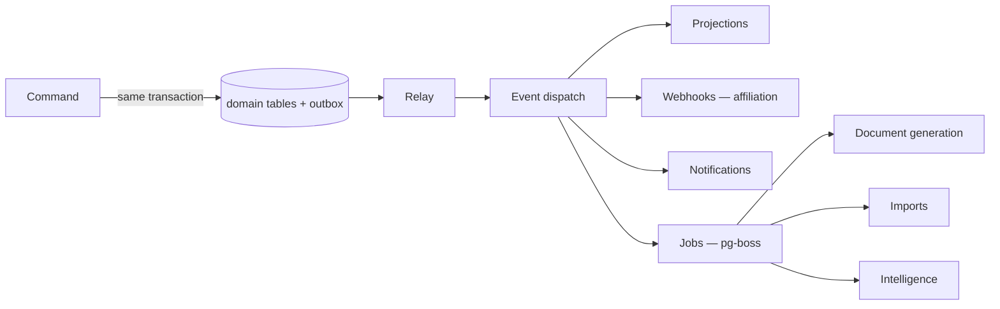

# ARCH-005 — Events, jobs, and scheduling

## The rule this picture encodes

**A fact and the record of that fact commit together, or neither does.** A command
writes its domain rows and its outbox entries in one transaction (`ADR-010`).
Nothing publishes to anything before that transaction commits.

## Events versus jobs

Conflating these is the common mistake, and their failure semantics are opposite.

| | Domain event | Job |
| --- | --- | --- |
| Is | a fact that already happened | work that must eventually be done |
| May be lost | never | may exhaust retries and be dead-lettered |
| Ordering | guaranteed per aggregate | none |
| Delivery | at least once; consumers idempotent | at least once; handlers idempotent |
| Written | in the originating transaction | enqueued transactionally, from an event |

A job that must not be lost is triggered by an event, never enqueued directly from
a request handler.

## A job is authenticated before it runs

The queue is a table in the same database as the domain (`ADR-010`). It is **not** a
trust boundary, and treating it as one is the assumption that produces this class of
incident.

Therefore (`ADR-021`): only the backend's database role may create a job; every
payload is sealed with an HMAC over its canonical form including institution,
principal, correlation id and issued-at; the consumer verifies signature and
freshness **before** opening a tenant context; and a payload never carries its own
authority — capabilities are resolved at execution from the database, never read
from the message.

An unsealed, mis-sealed or stale job is **quarantined and alerted on**, never
executed and never silently dropped. A rejected job is evidence that someone tried.

## Context does not travel implicitly

A job carries its institution and principal in its payload. The consumer opens a
fresh tenant-context store from them (`ADR-019 §7`). Context is never assumed to
survive the queue, and a job whose payload lacks it fails closed.

## Scheduling

Scheduled work — attendance eligibility recalculation, fee due reminders, statement
reconciliation prompts, projection maintenance — runs in the worker, per
institution, in that institution's timezone (`DOM-003-D`). A schedule that assumes
one timezone will be wrong for any institution outside it, and eventually for all
of them.

## Retries and poison

Every consumer is idempotent, keyed on the event or job identifier. Retries use
exponential backoff with a cap. A job that exhausts retries is dead-lettered and
surfaced to a human — silently dropped work is indistinguishable from work that
never existed.

**Webhook delivery to an affiliated institution carries a per-institution delivery
log** a person can inspect, because "did we send the results?" is a support
conversation waiting to happen (`ADR-010`, `JRN-003`).

## Related Documents

- `ADR-010` · `ADR-016` · `ADR-018` · `ADR-019` · `DOM-012-D` · `ARCH-002`
